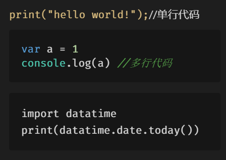

# 自我介绍
我的名字是invierno，下面我要介绍我的兴趣爱好和我了解的编程语言。
## 兴趣爱好
1. 滑雪
2. 旅行
3. 阅读
4. 看电影

## 编程语言
* C语言
* C++
* Python
* Java

## 代码展示
`print("hello world!");`//单行代码

```javascript
var a = 1
console.log(a) //多行代码
```
    import datatime  
    print(datatime.date.today())

## 博客链接
https://github.com/invierno123/blog-test/blob/master/readme.md

## 图片展示

